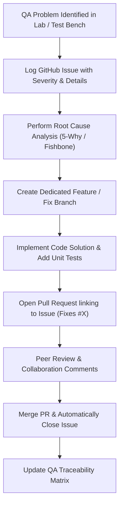

# Smart Multi-Mode LED & Status Controller (Embedded QA System)

[](https://opensource.org/licenses/MIT)
[](#qa-issues-and-bug-tracking)
[](#academic-metadata)

## Academic Metadata
- **Institution**: MIT Academy of Engineering, Alandi (D), Pune - 412105
- **Department**: Department of Electronics & Telecommunication Engineering
- **Course**: Project Management (`2307476T`) — Semester VII (B.Tech)
- **Activity**: Activity 1 — *GitHub-Based QA Documentation and Problem Solving based on Electronics/Cross Domain Projects*
- **Course Outcome**: CO2 (Level 3)
- **Author**: Pranav Karande

---

## 1. Project Overview & Architecture
This repository contains firmware and comprehensive Quality Assurance (QA) documentation for a **Smart Multi-Mode LED Status Indicator and Diagnostics Controller** built for ATmega328P/Arduino microcontrollers. 

In embedded systems and cross-domain electronics, reliability and deterministic timing are critical. This repository acts as a real-world demonstration of **GitHub-driven Quality Assurance**, using collaborative tools to systematically identify, perform Root Cause Analysis (RCA), branch, resolve, and verify firmware issues.

### Hardware Specifications & Pin Mapping
| Component | Microcontroller Pin | Function | Notes |
| :--- | :--- | :--- | :--- |
| **Status LED** | Digital Pin 9 (PWM `OC1A`) | Visual telemetry indicator | Current-limited with series resistor |
| **Tactile Push Button** | Digital Pin 2 (`INT0`) | User Mode Toggle Switch | Hardware or Software debounced |
| **UART Diagnostics** | Pin 0 (RX) & Pin 1 (TX) | Serial Telemetry & Debug | Default Baud: 9600 bps |

### Operational State Machine Modes
- **Mode 0 (`IDLE_OFF`)**: LED is fully deactivated (0% duty cycle, quiescent standby).
- **Mode 1 (`STEADY_ON`)**: Continuous illumination for status validation.
- **Mode 2 (`HEARTBEAT_BLINK`)**: Periodic slow beacon (1 Hz normal operation).
- **Mode 3 (`ALERT_STROBE`)**: High-frequency strobe (5 Hz emergency alert).

---

## 2. GitHub-Based QA Documentation & Workflow
This repository follows an industry-standard QA bug lifecycle:



---

## 3. QA Issues and Bug Tracking
All 4 core problems are tracked through GitHub Issues with structured Root Cause Analyses:

1. **[QA-01][CRITICAL]**: Blocking `delay()` freezes MCU execution and misses user button interrupts. (*RCA: 5-Why Analysis*)
2. **[QA-02][HIGH]**: Switch contact bounce and floating input pin causes spurious multi-triggering. (*RCA: Fishbone / Ishikawa Diagram*)
3. **[QA-03][HIGH]**: Overcurrent risk: LED driven at full 100% duty cycle exceeding safe GPIO current ratings. (*RCA: 5-Why Analysis*)
4. **[QA-04][MEDIUM]**: Serial telemetry baud rate mismatch and blocking buffer flood during debug transmission. (*RCA: Fishbone / Ishikawa Diagram*)

---

## 4. Repository Structure
```
├── .gitignore                      # Git ignore rules for build artifacts
├── README.md                       # Main repository overview & documentation
├── src/
│   └── smart_led_controller.ino    # Arduino C++ firmware source code
└── docs/
    ├── QA_DOCUMENTATION.md         # Comprehensive QA logs, RCA & Test evidence
    └── REPORT_PM_IA_ACTIVITY_1.md  # Official course submission report (MIT AOE)
```

---

## 5. License
Distributed under the MIT License. See `LICENSE` for more information.
